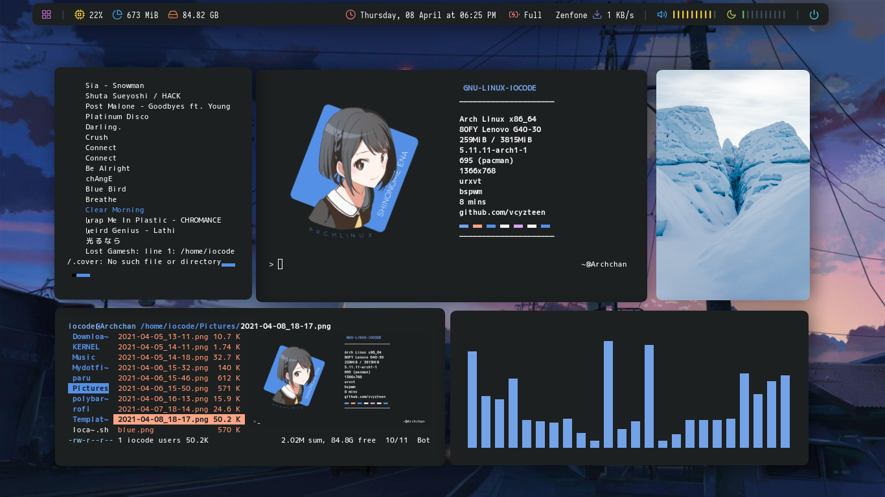

*                  bspwm - dotfiles

| Dark - Blue |
|-----------------------|
||

##### Dependency ( Install Before Want Use Dotfiles )
> used yay / paru for completely install dependency package
```bash

$ paru -S rsync dunst sxhkd pcmanfm python psmisc xorg-xprop xorg-xwininfo imagemagick \
ffmpeg wireless_tools bspwm pulseaudio pulseaudio-alsa alsa-utils brightnessctl nitrogen \
gsimplecal rofi polybar qt5-styleplugins xautolock rxvt-unicode-patched xclip scrot thunar \
thunar-archive-plugin thunar-volman thunar-media-tags-plugin ffmpegthumbnailer tumbler viewnior \
mpv mpd mpc networkmanager-dmenu ncmpcpp pavucontrol parcellite neofetch w3m htop picom-ibhagwan-git \
gtk2-perl playerctl pamixer flameshot ranger nvim pipes.sh fet.sh
```

##### Zsh-Ohmyzsh ( Optionally But Im Recommended )
> optionally for customize text in terminal
```bash

$ sudo pacman -S zsh &&
chsh -s $(command -v zsh) &&
sh -c "$(curl -fsSL https://raw.githubusercontent.com/ohmyzsh/ohmyzsh/master/tools/install.sh)" &&
git clone https://github.com/zsh-users/zsh-syntax-highlighting.git ${ZSH_CUSTOM:-~/.oh-my-zsh/custom}/plugins/zsh-syntax-highlighting &&
git clone https://github.com/zsh-users/zsh-autosuggestions.git ${ZSH_CUSTOM:-~/.oh-my-zsh/custom}/plugins/zsh-autosuggestions &&
git clone https://github.com/zsh-users/zsh-completions.git ${ZSH_CUSTOM:=~/.oh-my-zsh/custom}/plugins/zsh-completions
```

#### Installation
> You can clone or download it as a zip. After that put all files in the dotfiles folder to user's home directory.
```bash

$ git clone https://github.com/vcyzteen/Mydotfiles.git && cd Mydotfiles/
```

#### enable some services
> systemd.sh for systemd and runit.sh for runit ( if lazy to enable one by one )
```bash

$ sudo su
$ chmod +x runit.sh && chmod +x systemd.sh
$ bash <file.sh>
```

#### rsync files
> Recommended
```bash

$ rsync -avxHAXP --exclude '.git*' .* ~/
```

#### Details
<p align="center">

|         Item          | Value                                           |
| :-------------------: | :---------------------------------------------- |
|          OS           | ArchLinux, artix runit                          |
|          WM           | bspwm                                           |
|         Shell         | zsh                                             |
|          DM           | lightdm                                         |
|         Font          | M+1 / M+2                                       |
|      Compositor       | picom, compton                                  |
|     Notification      | dunst                                           |
|       Terminal        | urxvt                                           |
|       Launcher        | rofi, dmenu                                     |
|          Bar          | polybar                                         |
|       Wallpaper       | feh, nitrogen                                   |
|   Logout / Shutdown   | script                                          |
|    Volume Control     | pamixer, pulseaudio                             |
| Brightness Controller | keybind, mouse roll                             |
|    Network Applet     | networkmanager-dmenu                            |
|      Text Editor      | neovim                                          |

#### Credits & Many Thanks
> Inspiration and resources

* [owl4ce](https://github.com/owl4ce)
* [bandithijo](https://github.com/bandithijo)
* [6gk](https://github.com/6gk)
-----------------------------------------

#### Buy me a ko-fi
[](https://ko-fi.com/iocode)

-----------------------------------------
