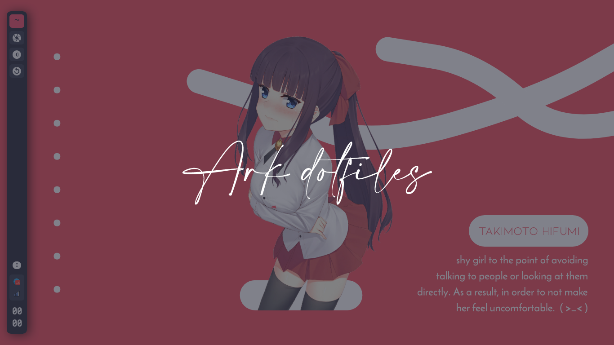

------------------------------
<b><p align="center">Bspwm - dotfiles</p></b>

------------------------------

| Ark |
|-----------------------|
||

------------------------------
<b><p align="center">Details</p></b>

------------------------------

```
---------------------------------------------------
|         Item          | Value                   |
| :-------------------: | :-----------------------|
|          OS           | ArchLinux, artix runit  |
|          WM           | bspwm                   |
|         Shell         | zsh                     |
|          DM           | lightdm                 |
|         Font          | M+1 / M+2               |
|      Compositor       | picom, compton          |
|     Notification      | dunst                   |
|       Terminal        | urxvt                   |
|       Launcher        | rofi, dmenu             |
|          Bar          | tint2                   |
|       Wallpaper       | feh                     |
|   Logout / Shutdown   | script                  |
|    Volume Control     | pamixer, pulseaudio     |
| Brightness Controller | keybind, mouse roll     |
|    Network Applet     | networkmanager-dmenu    |
|      Text Editor      | neovim                  |
---------------------------------------------------
```

------------------------------
<b><p align="center">Dependency ( Install Before Want Use Dotfiles )</p></b>

------------------------------

> used yay / paru for completely install dependency package
```bash

$ paru -S rsync dunst sxhkd pcmanfm python psmisc xorg-xprop xorg-xwininfo imagemagick \
ffmpeg wireless_tools bspwm pulseaudio pulseaudio-alsa alsa-utils brightnessctl nitrogen \
gsimplecal rofi tint2 qt5-styleplugins xautolock rxvt-unicode-patched xclip scrot thunar \
thunar-archive-plugin thunar-volman thunar-media-tags-plugin ffmpegthumbnailer tumbler viewnior \
mpv mpd mpc networkmanager-dmenu ncmpcpp pavucontrol parcellite neofetch w3m htop picom-ibhagwan-git \
gtk2-perl playerctl pamixer flameshot ranger nvim feh jgmenu ttf-mplus
```
------------------------------
<b><p align="center">Zsh-Ohmyzsh ( Optionally But Im Recommended )</p></b>

------------------------------

> optionally for customize text in terminal
```bash

$ sudo pacman -S zsh &&
chsh -s $(command -v zsh) &&
sh -c "$(curl -fsSL https://raw.githubusercontent.com/ohmyzsh/ohmyzsh/master/tools/install.sh)" &&
git clone https://github.com/zsh-users/zsh-syntax-highlighting.git ${ZSH_CUSTOM:-~/.oh-my-zsh/custom}/plugins/zsh-syntax-highlighting &&
git clone https://github.com/zsh-users/zsh-autosuggestions.git ${ZSH_CUSTOM:-~/.oh-my-zsh/custom}/plugins/zsh-autosuggestions &&
git clone https://github.com/zsh-users/zsh-completions.git ${ZSH_CUSTOM:=~/.oh-my-zsh/custom}/plugins/zsh-completions
```
------------------------------
<b><p align="center">Installation</p></b>

------------------------------

> You can clone or download it as a zip. After that put all files in the dotfiles folder to user's home directory.
```bash

$ git clone https://github.com/vcyzteen/Mydotfiles.git && cd Mydotfiles/
```
------------------------------
<b><p align="center">Enable some service</p></b>

------------------------------

> systemd.sh for systemd and runit.sh for runit ( if lazy to enable one by one )
```bash

$ sudo su
$ chmod +x runit.sh && chmod +x systemd.sh
$ bash <file.sh>
```
------------------------------
<b><p align="center">rsync file for replace dot file</p></b>

------------------------------

> Recommended
```bash

$ rsync -avxHAXP --exclude '.git*' .* ~/
```
------------------------------
<b><p align="center">how set wallpaper</p></b>

------------------------------

> open terminal first ( note this not permanently set ) if you need set wallpaper permanently go to *~/.config/bspwm/bspwmrc* and edit this line line feh /path/to/wall/io-match.png
```bash

$ bash ~/.scripts/wallset
```

------------------------------
<b><p align="center">Slim Themes "SOON"</p></b>
<p align="center">In fact, I use SLiM for default lockscreen.</p>
<p align="center"><a href="https://drive.google.com/drive/folders/1_Ktq9kGqDi0TNC8Q49AWpLo2HvWkPhnQ?usp=sharing">
</a></p>
<p align="center">Just click on the image above!</p>
> enable slim service by
    $ sudo systemctl disable lightdm.service 
    $ sudo systemctl enable slim.service   
> and if done next step
    Extract .zip files and copy folder extracted to /usr/share/slim/themes/
    Then edit the /etc/slim.conf file using text editor. Adjust, for example as follows:

    current_theme Ark-japan

------------------------------
<b><p align="center">Credits & Many Thanks</p></b>

------------------------------

> Inspiration and resources

* [owl4ce](https://github.com/owl4ce)
* [bandithijo](https://github.com/bandithijo)
* [6gk](https://github.com/6gk)
* [adi1090x](https://github.com/adi1090x)
-----------------------------------------

<b><p align="center">Buy me a ko-fi</p></b>

------------------------------

<p align="center"><a href="https://ko-fi.com/iocode"></a>

-----------------------------------------
